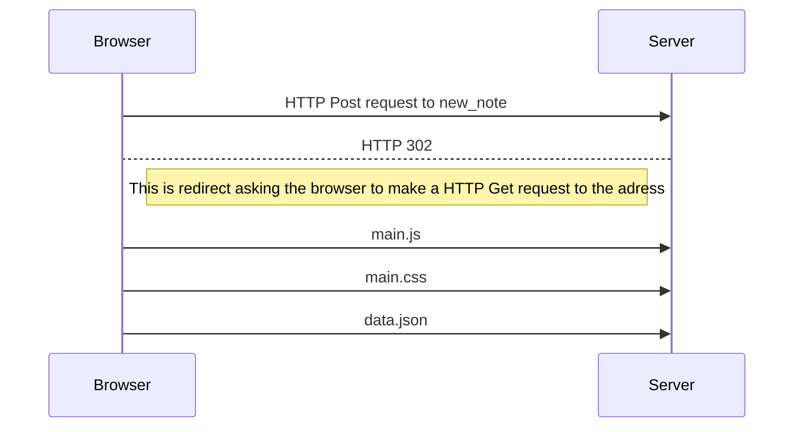

```mermaid
sequenceDiagram
    Browser->>Server: HTTP Post request to new_note
    Server-->Browser: HTTP 302
    Note right of Browser: This is redirect asking the browser to make a HTTP Get request to the adress
    Browser->>Server: main.js
    Browser->>Server: main.css
    Browser->>Server: data.json

```
