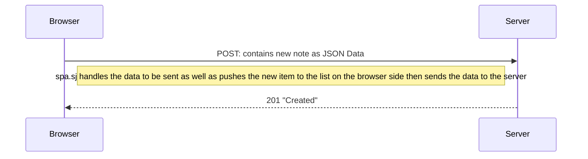

```mermaid
sequenceDiagram
  Browser ->> Server: POST: contains new note as JSON Data

  note right of Browser: spa.sj handles the data to be sent as well as pushes the new item to the list on the browser side then sends the data to the server

  Server -->> Browser: 201 "Created"
```
